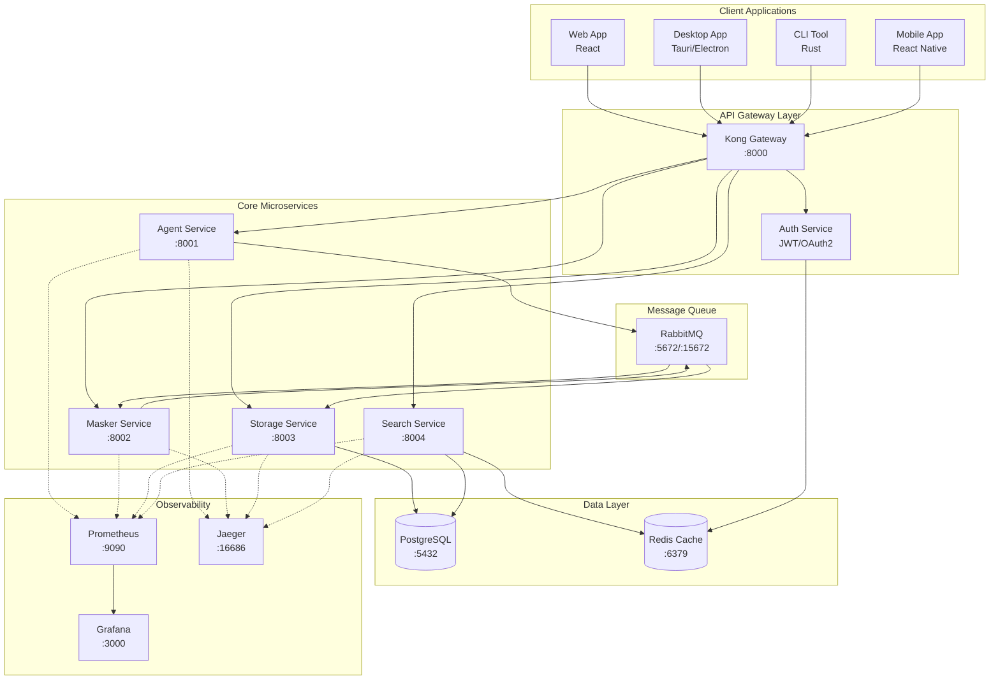
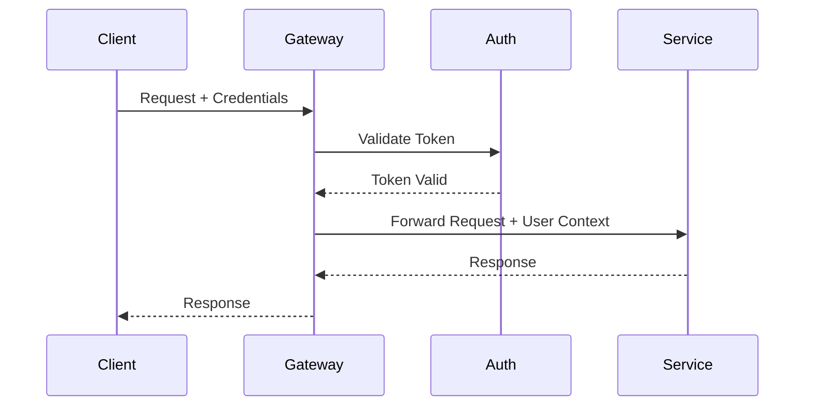

# 🏗️ Arquitetura de Microsserviços KeyAI

## 📋 Índice

- [Visão Geral](#visão-geral)
- [Arquitetura do Sistema](#arquitetura-do-sistema)
- [Serviços](#serviços)
- [Comunicação entre Serviços](#comunicação-entre-serviços)
- [API Gateway](#api-gateway)
- [Segurança](#segurança)
- [Observabilidade](#observabilidade)
- [Deployment](#deployment)

## 🎯 Visão Geral

A arquitetura de microsserviços do KeyAI foi projetada para oferecer:

- **Escalabilidade**: Cada serviço pode escalar independentemente
- **Resiliência**: Falhas isoladas não afetam o sistema completo
- **Flexibilidade**: Tecnologias diferentes para cada serviço
- **Manutenibilidade**: Deploy e atualização independentes
- **API-First**: Todas as funcionalidades expostas via REST APIs

## 🏛️ Arquitetura do Sistema



## 🔧 Serviços

### 1. Agent Service (Porta 8001)

**Responsabilidade**: Captura e gerenciamento de eventos de teclado

**Endpoints**:
- `POST /api/v1/agent/start` - Inicia captura
- `POST /api/v1/agent/stop` - Para captura
- `GET /api/v1/agent/status` - Status atual
- `GET /api/v1/agent/metrics` - Métricas de captura
- `POST /api/v1/agent/configure` - Atualiza configuração

**Tecnologias**:
- Rust + Axum
- rdev para captura de teclas
- RabbitMQ para publicação de eventos

### 2. Masker Service (Porta 8002)

**Responsabilidade**: Mascaramento de PII (Informações Pessoais Identificáveis)

**Endpoints**:
- `POST /api/v1/mask` - Mascara texto único
- `POST /api/v1/mask/batch` - Mascara múltiplos textos
- `GET /api/v1/patterns` - Lista padrões de PII
- `POST /api/v1/patterns` - Atualiza padrões
- `GET /api/v1/statistics` - Estatísticas de mascaramento

**Tecnologias**:
- Rust + Axum
- Regex para detecção de padrões
- RabbitMQ para consumo/publicação

### 3. Storage Service (Porta 8003)

**Responsabilidade**: Persistência e gerenciamento de dados

**Endpoints**:
- `POST /api/v1/events` - Armazena evento
- `GET /api/v1/events/{id}` - Busca evento por ID
- `GET /api/v1/events` - Lista eventos com filtros
- `DELETE /api/v1/events/{id}` - Remove evento
- `GET /api/v1/statistics` - Estatísticas de armazenamento
- `POST /api/v1/export` - Exporta dados

**Tecnologias**:
- Rust + Axum
- PostgreSQL com SQLx
- RabbitMQ para consumo de eventos

### 4. Search Service (Porta 8004)

**Responsabilidade**: Busca textual e semântica

**Endpoints**:
- `POST /api/v1/search/text` - Busca textual
- `POST /api/v1/search/semantic` - Busca semântica
- `POST /api/v1/search/hybrid` - Busca híbrida
- `GET /api/v1/search/suggestions` - Sugestões de busca
- `GET /api/v1/search/trending` - Trending topics
- `POST /api/v1/search/cache/clear` - Limpa cache

**Tecnologias**:
- Rust + Axum
- PostgreSQL para busca full-text
- Redis para cache
- Candle para embeddings (futuro)

## 📡 Comunicação entre Serviços

### Comunicação Síncrona (REST)

```yaml
# Exemplo de chamada REST
GET http://storage-service:8003/api/v1/events/123
Authorization: Bearer <token>
```

### Comunicação Assíncrona (RabbitMQ)

```yaml
# Filas RabbitMQ
Queues:
  - key_events: Agent -> Masker
  - masked_events: Masker -> Storage
  - search_updates: Storage -> Search

# Padrão de mensagem
{
  "id": "uuid",
  "timestamp": 1234567890,
  "type": "key_event",
  "payload": { ... }
}
```

## 🚪 API Gateway

### Configuração Kong

```yaml
# docker/kong.yml
_format_version: "3.0"

services:
  - name: agent-service
    url: http://agent-service:8001
    routes:
      - name: agent-routes
        paths:
          - /api/v1/agent
        strip_path: false

  - name: masker-service
    url: http://masker-service:8002
    routes:
      - name: masker-routes
        paths:
          - /api/v1/mask
        strip_path: false

  - name: storage-service
    url: http://storage-service:8003
    routes:
      - name: storage-routes
        paths:
          - /api/v1/events
          - /api/v1/statistics
          - /api/v1/export
        strip_path: false

  - name: search-service
    url: http://search-service:8004
    routes:
      - name: search-routes
        paths:
          - /api/v1/search
        strip_path: false

plugins:
  - name: cors
    config:
      origins:
        - "*"
      methods:
        - GET
        - POST
        - PUT
        - DELETE
        - OPTIONS
      headers:
        - Accept
        - Accept-Version
        - Content-Length
        - Content-MD5
        - Content-Type
        - Date
        - X-Auth-Token
        - Authorization
      exposed_headers:
        - X-Auth-Token
      credentials: true
      max_age: 3600

  - name: rate-limiting
    config:
      minute: 60
      hour: 1000
      policy: local

  - name: jwt
    config:
      secret_is_base64: false
      claims_to_verify:
        - exp
```

## 🔒 Segurança

### Autenticação e Autorização



### Políticas de Segurança

1. **Autenticação JWT**: Todos os endpoints protegidos
2. **Rate Limiting**: 60 req/min, 1000 req/hora
3. **CORS**: Configurado no gateway
4. **TLS**: Obrigatório em produção
5. **Secrets Management**: Via environment variables

## 📊 Observabilidade

### Métricas (Prometheus)

```yaml
# Métricas expostas por cada serviço
- http_requests_total
- http_request_duration_seconds
- business_events_processed_total
- business_processing_duration_seconds
```

### Logs Estruturados

```json
{
  "timestamp": "2024-01-20T10:30:00Z",
  "level": "INFO",
  "service": "agent-service",
  "trace_id": "abc123",
  "span_id": "def456",
  "message": "Event captured",
  "metadata": {
    "event_type": "key_press",
    "application": "Terminal"
  }
}
```

### Distributed Tracing (Jaeger)

```rust
// Exemplo de instrumentação
#[instrument(skip(state))]
async fn search_text(
    State(state): State<AppState>,
    Json(request): Json<SearchRequest>,
) -> impl IntoResponse {
    // Código instrumentado automaticamente
}
```

## 🚀 Deployment

### Docker Compose (Desenvolvimento)

```bash
# Iniciar todos os serviços
docker-compose up -d

# Verificar status
docker-compose ps

# Ver logs
docker-compose logs -f agent-service

# Parar serviços
docker-compose down
```

### Kubernetes (Produção)

```yaml
# k8s/agent-service-deployment.yaml
apiVersion: apps/v1
kind: Deployment
metadata:
  name: agent-service
spec:
  replicas: 3
  selector:
    matchLabels:
      app: agent-service
  template:
    metadata:
      labels:
        app: agent-service
    spec:
      containers:
      - name: agent-service
        image: keyai/agent-service:latest
        ports:
        - containerPort: 8001
        env:
        - name: RUST_LOG
          value: "info"
        - name: RABBITMQ_URL
          valueFrom:
            secretKeyRef:
              name: rabbitmq-secret
              key: url
        livenessProbe:
          httpGet:
            path: /health
            port: 8001
          initialDelaySeconds: 30
          periodSeconds: 10
        readinessProbe:
          httpGet:
            path: /health
            port: 8001
          initialDelaySeconds: 5
          periodSeconds: 5
```

### CI/CD Pipeline

```yaml
# .github/workflows/microservices.yml
name: Microservices CI/CD

on:
  push:
    branches: [main]
  pull_request:
    branches: [main]

jobs:
  test:
    runs-on: ubuntu-latest
    strategy:
      matrix:
        service: [agent-service, masker-service, storage-service, search-service]
    steps:
      - uses: actions/checkout@v3
      - name: Run tests
        run: |
          cd services/${{ matrix.service }}
          cargo test

  build:
    needs: test
    runs-on: ubuntu-latest
    strategy:
      matrix:
        service: [agent-service, masker-service, storage-service, search-service]
    steps:
      - uses: actions/checkout@v3
      - name: Build and push Docker image
        run: |
          cd services/${{ matrix.service }}
          docker build -t keyai/${{ matrix.service }}:${{ github.sha }} .
          docker push keyai/${{ matrix.service }}:${{ github.sha }}
```

## 🔄 Migração do Monólito

### Fase 1: Extração do Agent Service
1. Criar API REST para captura
2. Manter compatibilidade com sistema atual
3. Redirecionar gradualmente tráfego

### Fase 2: Extração do Masker Service
1. Implementar fila de mensagens
2. Processar eventos em paralelo
3. Validar mascaramento

### Fase 3: Extração do Storage Service
1. Migrar dados para PostgreSQL
2. Implementar API de persistência
3. Garantir consistência

### Fase 4: Extração do Search Service
1. Implementar busca distribuída
2. Adicionar cache Redis
3. Otimizar performance

## 📈 Monitoramento e SLAs

### Service Level Objectives (SLOs)

| Serviço | Disponibilidade | Latência P95 | Taxa de Erro |
|---------|----------------|--------------|--------------|
| Agent | 99.9% | < 10ms | < 0.1% |
| Masker | 99.5% | < 50ms | < 0.5% |
| Storage | 99.9% | < 100ms | < 0.1% |
| Search | 99.5% | < 200ms | < 1.0% |

### Alertas

```yaml
# prometheus/alerts.yml
groups:
  - name: keyai-alerts
    rules:
      - alert: HighErrorRate
        expr: rate(http_requests_total{status=~"5.."}[5m]) > 0.05
        for: 5m
        labels:
          severity: critical
        annotations:
          summary: "High error rate on {{ $labels.service }}"
          
      - alert: HighLatency
        expr: histogram_quantile(0.95, http_request_duration_seconds) > 0.5
        for: 10m
        labels:
          severity: warning
        annotations:
          summary: "High latency on {{ $labels.service }}"
```

## 🛠️ Ferramentas de Desenvolvimento

### Postman Collection
```json
{
  "info": {
    "name": "KeyAI Microservices",
    "schema": "https://schema.getpostman.com/json/collection/v2.1.0/collection.json"
  },
  "item": [
    {
      "name": "Agent Service",
      "item": [
        {
          "name": "Start Agent",
          "request": {
            "method": "POST",
            "header": [],
            "url": {
              "raw": "{{base_url}}/api/v1/agent/start",
              "host": ["{{base_url}}"],
              "path": ["api", "v1", "agent", "start"]
            }
          }
        }
      ]
    }
  ]
}
```

### Scripts de Desenvolvimento

```bash
# scripts/dev.sh
#!/bin/bash

# Iniciar infraestrutura
docker-compose up -d postgres redis rabbitmq

# Iniciar serviços em modo desenvolvimento
(cd services/agent-service && cargo watch -x run) &
(cd services/masker-service && cargo watch -x run) &
(cd services/storage-service && cargo watch -x run) &
(cd services/search-service && cargo watch -x run) &

# Aguardar CTRL+C
wait
```

## 📚 Recursos Adicionais

- [OpenAPI Specifications](./docs/openapi/)
- [Postman Collection](./postman/)
- [Architecture Decision Records](./docs/adr/)
- [Performance Benchmarks](./benchmarks/)

---

Esta arquitetura de microsserviços oferece a flexibilidade e escalabilidade necessárias para o crescimento do KeyAI, mantendo a segurança e privacidade como prioridades fundamentais. 