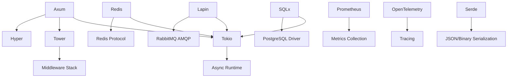

# Dependências dos Microsserviços KeyAI

Este documento fornece uma visão abrangente de todas as dependências utilizadas na arquitetura de microsserviços do KeyAI, incluindo suas funcionalidades, versões e casos de uso específicos.

## 📋 Índice

- [Dependências Principais](#dependências-principais)
- [Dependências de Infraestrutura](#dependências-de-infraestrutura)
- [Dependências de Observabilidade](#dependências-de-observabilidade)
- [Dependências de Segurança](#dependências-de-segurança)
- [Dependências de Desenvolvimento](#dependências-de-desenvolvimento)
- [Dependências de Testes](#dependências-de-testes)

## 🚀 Dependências Principais

### Web Framework - Axum 0.7+

**Repositório:** [tokio-rs/axum](https://github.com/tokio-rs/axum)  
**Documentação:** [docs.rs/axum](https://docs.rs/axum)  
**Licença:** MIT

#### Características
- Framework web ergonômico e modular para Rust
- Construído sobre Tokio, Tower e Hyper
- API livre de macros para roteamento
- Extractors declarativos para parsing de requests
- Modelo de tratamento de erros simples e previsível
- Integração completa com o ecossistema Tower/Tower-HTTP

#### Por que Escolhemos
- **Performance:** Overhead mínimo sobre Hyper (~89k req/s)
- **Ergonomia:** API intuitiva sem DSL complexa
- **Ecossistema:** Aproveita todo middleware do Tower
- **Type Safety:** Extrações de dados type-safe
- **Async-first:** Projetado para async/await desde o início

#### Uso nos Microsserviços
```rust
// Exemplo de uso no Auth Service
use axum::{
    routing::{get, post},
    extract::{State, Json},
    Router,
};

let app = Router::new()
    .route("/login", post(login_handler))
    .route("/profile", get(profile_handler))
    .with_state(app_state);
```

#### Features Utilizadas
- `macros`: Para debug handlers
- `json`: Suporte a JSON nativo
- `query`: Extração de query parameters
- `tracing`: Logging automático

---

### Runtime Assíncrono - Tokio 1.35+

**Repositório:** [tokio-rs/tokio](https://github.com/tokio-rs/tokio)  
**Documentação:** [docs.rs/tokio](https://docs.rs/tokio)  
**Licença:** MIT

#### Características
- Runtime assíncrono para Rust
- Executor multi-threaded work-stealing
- I/O assíncrono (TCP, UDP, Unix sockets)
- Temporizadores e timeouts
- Synchronization primitives (Mutex, RwLock, channels)

#### Features Utilizadas
- `full`: Todas as funcionalidades
- `macros`: `#[tokio::main]` e `#[tokio::test]`
- `rt-multi-thread`: Runtime multi-thread
- `net`: Networking assíncrono
- `time`: Timeouts e timers

---

### Banco de Dados - SQLx 0.8+

**Repositório:** [launchbadge/sqlx](https://github.com/launchbadge/sqlx)  
**Documentação:** [docs.rs/sqlx](https://docs.rs/sqlx)  
**Licença:** MIT/Apache-2.0

#### Características
- Toolkit SQL assíncrono para Rust
- Queries verificadas em tempo de compilação
- Suporte para PostgreSQL, MySQL, SQLite
- Connection pooling integrado
- Migrações automáticas
- Type-safe query builder

#### Features Utilizadas
```toml
sqlx = { 
    version = "0.8", 
    features = [
        "runtime-tokio-rustls",
        "postgres", 
        "uuid", 
        "chrono", 
        "json",
        "migrate"
    ] 
}
```

#### Por que Escolhemos
- **Compile-time Safety:** Queries verificadas durante build
- **Performance:** Pooling de conexões otimizado
- **Async Native:** Construído para async desde o início
- **Migrations:** Sistema de migrações integrado
- **Type Safety:** Mapeamento automático Rust ↔ SQL

---

### Message Queue - Lapin 2.3+

**Repositório:** [CleverCloud/lapin](https://github.com/CleverCloud/lapin)  
**Documentação:** [docs.rs/lapin](https://docs.rs/lapin)  
**Licença:** MIT

#### Características
- Cliente RabbitMQ puro Rust
- Suporte completo ao protocolo AMQP 0.9.1
- Connection pooling com deadpool-lapin
- Confirmações de publisher
- Consumer streams assíncronos

#### Uso nos Microsserviços
```rust
// Configuração de publisher (Capture Service)
use lapin::{Connection, ConnectionProperties, Channel};

let conn = Connection::connect(&rabbitmq_url, ConnectionProperties::default()).await?;
let channel = conn.create_channel().await?;

// Publicar evento
channel.basic_publish(
    "keystrokes",           // exchange
    "raw.keystroke",        // routing key
    BasicPublishOptions::default(),
    &event_payload,
    BasicProperties::default(),
).await?;
```

#### Por que Escolhemos
- **Reliability:** Protocolo AMQP robusto
- **Performance:** Implementação otimizada em Rust
- **Scalability:** Suporte a clustering RabbitMQ
- **Features:** Exchanges, queues, routing completo

---

## 🏗️ Dependências de Infraestrutura

### HTTP Client - Tower & Tower-HTTP 0.5+

**Repositório:** [tower-rs/tower](https://github.com/tower-rs/tower)  
**Licença:** MIT

#### Características
- Biblioteca modular para construir networking clients/servers
- Middleware composável
- Load balancing, circuit breakers, retries
- Rate limiting e timeout

#### Features Utilizadas
```toml
tower-http = { 
    version = "0.5", 
    features = [
        "cors", 
        "trace", 
        "compression", 
        "timeout",
        "compression-gzip",
        "decompression-gzip"
    ] 
}
```

---

### Cache - Redis 0.24+

**Repositório:** [redis-rs/redis-rs](https://github.com/redis-rs/redis-rs)  
**Licença:** MIT  
**Dependência:** `redis = "0.24"`  
**Features:** `["tokio-comp", "connection-manager"]`

#### Uso nos Microsserviços
- **Auth Service:** Cache de sessões e tokens JWT
- **Search Service:** Cache de resultados de busca frequentes  
- **Rate Limiting:** Controle de taxa distribuído
- **Shared State:** Estado compartilhado entre instâncias

#### Configuração
```rust
use redis::{Client, AsyncCommands};

let client = Client::open("redis://localhost:6379")?;
let mut con = client.get_async_connection().await?;

// Cache de sessão
con.setex::<&str, &str, ()>("session:user123", 3600, &session_data).await?;
```

---

### Serialização - Serde 1.0+

**Repositório:** [serde-rs/serde](https://github.com/serde-rs/serde)  
**Licença:** MIT/Apache-2.0

#### Dependências Relacionadas
- `serde_json`: Serialização JSON para APIs REST
- `bincode`: Serialização binária eficiente para cache
- `serde_urlencoded`: Form data para requests HTTP
- `prost`: Protocol Buffers para comunicação gRPC

---

## 🐳 Dependências de Infraestrutura (Docker)

### Kong API Gateway 3.10+

**Repositório:** [Kong/kong](https://github.com/Kong/kong)  
**Documentação:** [docs.konghq.com](https://docs.konghq.com/)  
**Licença:** Apache-2.0  
**Docker Image:** `kong:3.10-alpine`

#### Características
- API Gateway de alta performance
- Plugin ecosystem extensivo
- Load balancing e service discovery
- Rate limiting e circuit breakers
- Observabilidade integrada

#### Configuração
```yaml
# docker-compose.yml
services:
  kong:
    image: kong:3.10-alpine
    environment:
      - KONG_DATABASE=off
      - KONG_DECLARATIVE_CONFIG=/usr/local/kong/kong.yml
      - KONG_PROXY_ACCESS_LOG=/dev/stdout
      - KONG_ADMIN_LISTEN=0.0.0.0:8001
    ports:
      - "8000:8000"   # Proxy HTTP
      - "8001:8001"   # Admin API
      - "8443:8443"   # Proxy HTTPS
      - "8444:8444"   # Admin HTTPS
```

#### Plugins Utilizados
- **Rate Limiting:** Controle de taxa por consumidor
- **CORS:** Cross-Origin Resource Sharing
- **JWT:** Autenticação via JSON Web Tokens
- **Prometheus:** Métricas automáticas
- **Request Transformer:** Transformação de requests

---

### PostgreSQL 15+

**Repositório:** [postgres/postgres](https://github.com/postgres/postgres)  
**Documentação:** [postgresql.org](https://www.postgresql.org/)  
**Licença:** PostgreSQL  
**Docker Image:** `postgres:15-alpine`

#### Características
- Banco de dados relacional ACID-compliant
- Suporte completo a JSON/JSONB
- Extensões avançadas (UUID, PostGIS)
- Replicação e high availability
- Performance excelente para OLTP

#### Configuração
```yaml
# docker-compose.yml
services:
  postgres:
    image: postgres:15-alpine
    environment:
      - POSTGRES_DB=keyai
      - POSTGRES_USER=keyai_user
      - POSTGRES_PASSWORD=${POSTGRES_PASSWORD}
    ports:
      - "5432:5432"
    volumes:
      - postgres_data:/var/lib/postgresql/data
      - ./init-db.sql:/docker-entrypoint-initdb.d/init-db.sql
```

#### Extensions Utilizadas
- **uuid-ossp:** Geração de UUIDs
- **pg_trgm:** Busca full-text otimizada
- **pg_stat_statements:** Análise de performance

---

### RabbitMQ 3.12+

**Repositório:** [rabbitmq/rabbitmq-server](https://github.com/rabbitmq/rabbitmq-server)  
**Documentação:** [rabbitmq.com](https://www.rabbitmq.com/)  
**Licença:** MPL-2.0  
**Docker Image:** `rabbitmq:3.12-management`

#### Características
- Message broker AMQP 0.9.1
- Clustering e high availability
- Management UI integrado
- Plugin ecosystem extensivo
- Dead letter queues

#### Configuração
```yaml
# docker-compose.yml
services:
  rabbitmq:
    image: rabbitmq:3.12-management
    environment:
      - RABBITMQ_DEFAULT_USER=keyai
      - RABBITMQ_DEFAULT_PASS=${RABBITMQ_PASSWORD}
    ports:
      - "5672:5672"   # AMQP
      - "15672:15672" # Management UI
    volumes:
      - rabbitmq_data:/var/lib/rabbitmq
```

#### Exchanges e Queues
```erlang
% Configuração de exchanges
capture.direct    # Eventos de captura
masking.direct    # Eventos processados
storage.direct    # Eventos para armazenamento
deadletter.fanout # Dead letter exchange
```

---

### Redis 7.0+

**Repositório:** [redis/redis](https://github.com/redis/redis)  
**Documentação:** [redis.io](https://redis.io/)  
**Licença:** BSD-3-Clause  
**Docker Image:** `redis:7.0-alpine`

#### Características
- In-memory data store
- Suporte a estruturas complexas
- Pub/Sub messaging
- Lua scripting
- Persistence configurável

#### Configuração
```yaml
# docker-compose.yml
services:
  redis:
    image: redis:7.0-alpine
    command: redis-server --appendonly yes --requirepass ${REDIS_PASSWORD}
    ports:
      - "6379:6379"
    volumes:
      - redis_data:/data
```

---

## 📊 Dependências de Observabilidade

### Métricas - Prometheus 0.13+

**Repositório:** [prometheus/client_rust](https://github.com/prometheus/client_rust)  
**Licença:** Apache-2.0

#### Uso
```rust
use prometheus::{Counter, Histogram, Registry};

// Métricas customizadas por serviço
let events_captured = Counter::new("capture_events_total", "Total events captured")?;
let processing_latency = Histogram::with_opts(
    prometheus::HistogramOpts::new("processing_latency_seconds", "Processing time")
        .buckets(vec![0.001, 0.005, 0.01, 0.05, 0.1])
)?;
```

#### Métricas Coletadas
- **Capture Service:** Eventos capturados, publicados, erros
- **Masker Service:** Textos processados, PII encontrado, latência
- **Storage Service:** Operações de escrita, latência de DB
- **Search Service:** Queries executadas, cache hits/misses
- **Auth Service:** Logins, tokens gerados, sessões ativas

---

### Tracing - OpenTelemetry 0.21+

**Repositório:** [open-telemetry/opentelemetry-rust](https://github.com/open-telemetry/opentelemetry-rust)  
**Licença:** Apache-2.0

#### Dependências
```toml
opentelemetry = { version = "0.21", features = ["rt-tokio"] }
opentelemetry-otlp = "0.14"
tracing = "0.1"
tracing-subscriber = { version = "0.3", features = ["env-filter", "json"] }
tracing-opentelemetry = "0.22"
```

#### Configuração
```rust
use tracing_subscriber::{layer::SubscriberExt, util::SubscriberInitExt};

// Configuração de tracing distribuído
let tracer = opentelemetry_otlp::new_pipeline()
    .tracing()
    .with_exporter(opentelemetry_otlp::new_exporter().tonic())
    .install_simple()?;

tracing_subscriber::registry()
    .with(tracing_subscriber::EnvFilter::from_default_env())
    .with(tracing_subscriber::fmt::layer().json())
    .with(tracing_opentelemetry::layer().with_tracer(tracer))
    .init();
```

---

### Axum Prometheus Integration

**Dependência:** `axum-prometheus = "0.4"`

#### Funcionalidades
- Métricas automáticas de HTTP (latência, status codes)
- Endpoint `/metrics` automático
- Integração nativa com extractors Axum

---

### Prometheus Server 2.45+

**Repositório:** [prometheus/prometheus](https://github.com/prometheus/prometheus)  
**Documentação:** [prometheus.io](https://prometheus.io/)  
**Licença:** Apache-2.0  
**Docker Image:** `prom/prometheus:v2.45.0`

#### Características
- Time series database especializada em métricas
- PromQL query language poderosa
- Service discovery automático
- Alerting integrado via Alertmanager
- Storage eficiente com compressão

#### Configuração
```yaml
# docker-compose.yml
services:
  prometheus:
    image: prom/prometheus:v2.45.0
    ports:
      - "9090:9090"
    volumes:
      - ./prometheus.yml:/etc/prometheus/prometheus.yml
      - prometheus_data:/prometheus
    command:
      - '--config.file=/etc/prometheus/prometheus.yml'
      - '--storage.tsdb.path=/prometheus'
      - '--web.console.libraries=/etc/prometheus/console_libraries'
      - '--web.console.templates=/etc/prometheus/consoles'
```

#### Targets Configurados
```yaml
# prometheus.yml
scrape_configs:
  - job_name: 'auth-service'
    static_configs:
      - targets: ['auth-service:3005']
  - job_name: 'capture-service'  
    static_configs:
      - targets: ['capture-service:3001']
  - job_name: 'masker-service'
    static_configs:
      - targets: ['masker-service:3002']
```

---

### Grafana 10.0+

**Repositório:** [grafana/grafana](https://github.com/grafana/grafana)  
**Documentação:** [grafana.com](https://grafana.com/)  
**Licença:** AGPL-3.0  
**Docker Image:** `grafana/grafana:10.0.0`

#### Características
- Dashboard e visualização avançada
- Suporte a múltiplas fontes de dados
- Alerting configurável
- Plugin ecosystem extensivo
- Sharing e collaboration

#### Configuração
```yaml
# docker-compose.yml
services:
  grafana:
    image: grafana/grafana:10.0.0
    ports:
      - "3000:3000"
    environment:
      - GF_SECURITY_ADMIN_PASSWORD=${GRAFANA_PASSWORD}
    volumes:
      - grafana_data:/var/lib/grafana
      - ./grafana/dashboards:/etc/grafana/provisioning/dashboards
      - ./grafana/datasources:/etc/grafana/provisioning/datasources
```

#### Dashboards Principais
- **Services Overview:** Métricas gerais dos microsserviços
- **Kong Gateway:** API Gateway performance e traffic
- **Database Performance:** PostgreSQL metrics e slow queries
- **RabbitMQ Monitoring:** Message queues e throughput
- **Error Tracking:** Logs de erro e alertas

---

### Jaeger 1.48+

**Repositório:** [jaegertracing/jaeger](https://github.com/jaegertracing/jaeger)  
**Documentação:** [jaegertracing.io](https://www.jaegertracing.io/)  
**Licença:** Apache-2.0  
**Docker Image:** `jaegertracing/all-in-one:1.48`

#### Características
- Distributed tracing system
- OpenTelemetry compatible
- Service dependency mapping
- Performance analysis
- Root cause analysis

#### Configuração
```yaml
# docker-compose.yml
services:
  jaeger:
    image: jaegertracing/all-in-one:1.48
    ports:
      - "16686:16686"  # Jaeger UI
      - "14268:14268"  # Jaeger collector HTTP
      - "4317:4317"    # OTLP gRPC receiver
      - "4318:4318"    # OTLP HTTP receiver
    environment:
      - COLLECTOR_OTLP_ENABLED=true
```

#### Instrumentação Rust
```rust
use opentelemetry_jaeger::new_agent_pipeline;
use tracing_opentelemetry::OpenTelemetryLayer;

let tracer = new_agent_pipeline()
    .with_service_name("capture-service")
    .install_simple()?;

tracing_subscriber::registry()
    .with(OpenTelemetryLayer::new(tracer))
    .init();
```

---

## 🔒 Dependências de Segurança

### JWT - jsonwebtoken 9.2+

**Repositório:** [Keats/jsonwebtoken](https://github.com/Keats/jsonwebtoken)  
**Licença:** MIT

#### Uso no Auth Service
```rust
use jsonwebtoken::{encode, decode, Header, Validation, EncodingKey, DecodingKey};

// Geração de token
let token = encode(
    &Header::default(),
    &claims,
    &EncodingKey::from_secret(jwt_secret.as_ref())
)?;

// Validação de token
let token_data = decode::<Claims>(
    &token,
    &DecodingKey::from_secret(jwt_secret.as_ref()),
    &Validation::default()
)?;
```

---

### Hashing - Argon2 0.5+

**Repositório:** [RustCrypto/password-hashes](https://github.com/RustCrypto/password-hashes)  
**Licença:** MIT/Apache-2.0

#### Uso
```rust
use argon2::{Argon2, PasswordHash, PasswordHasher, PasswordVerifier};

// Hash de senha
let password_hash = Argon2::default()
    .hash_password(password.as_bytes(), &salt)?
    .to_string();

// Verificação
let parsed_hash = PasswordHash::new(&password_hash)?;
Argon2::default().verify_password(password.as_bytes(), &parsed_hash)?;
```

---

### Regex - regex 1.10+

**Uso:** Detecção de PII no Masker Service

#### Padrões Implementados
```rust
lazy_static! {
    static ref EMAIL_REGEX: Regex = Regex::new(
        r"[a-zA-Z0-9._%+-]+@[a-zA-Z0-9.-]+\.[a-zA-Z]{2,}"
    ).unwrap();
    
    static ref CPF_REGEX: Regex = Regex::new(
        r"\d{3}\.\d{3}\.\d{3}-\d{2}"
    ).unwrap();
    
    static ref PHONE_REGEX: Regex = Regex::new(
        r"(\+55\s?)?(\(?\d{2}\)?\s?)?\d{4,5}-?\d{4}"
    ).unwrap();
}
```

---

## 🛠️ Dependências de Desenvolvimento

### Configuração

#### Config 0.13+
```rust
use config::{Config, Environment};

let settings = Config::builder()
    .add_source(Environment::with_prefix("APP"))
    .build()?;
```

#### Dotenv 0.15+
```rust
use dotenv::dotenv;

dotenv().ok();
let database_url = env::var("DATABASE_URL")?;
```

---

### Utilitários

#### UUID 1.6+
```rust
use uuid::Uuid;

let id = Uuid::new_v4();  // Geração de IDs únicos
```

#### Chrono 0.4+
```rust
use chrono::{DateTime, Utc};

let timestamp = Utc::now();
```

#### Anyhow 1.0+
```rust
use anyhow::{Result, anyhow};

fn process_data() -> Result<String> {
    // Tratamento de erro simplificado
    Ok("processed".to_string())
}
```

---

## 📚 Dependências de API

### OpenAPI - Utoipa 4.1+

**Repositório:** [juhaku/utoipa](https://github.com/juhaku/utoipa)  
**Licença:** MIT/Apache-2.0

#### Funcionalidades
- Geração automática de documentação OpenAPI
- Swagger UI integrado
- Schemas deriváveis automaticamente
- Validação de tipos

#### Uso
```rust
use utoipa::{OpenApi, ToSchema};

#[derive(ToSchema, Serialize, Deserialize)]
struct LoginRequest {
    #[schema(example = "user@example.com")]
    email: String,
    #[schema(example = "password123")]
    password: String,
}

#[utoipa::path(
    post,
    path = "/auth/login",
    request_body = LoginRequest,
    responses(
        (status = 200, description = "Login successful", body = LoginResponse),
        (status = 401, description = "Invalid credentials")
    )
)]
async fn login() { }
```

---

## 🧪 Dependências de Testes

### Testes Unitários
- `tokio-test`: Utilitários para testes assíncronos
- `mockall`: Mocking para testes isolados
- `proptest`: Property-based testing

### Testes de Integração
- `reqwest`: Cliente HTTP para testes de API
- `testcontainers`: Containers para testes de integração

### Benchmarking
- `criterion`: Microbenchmarks precisos

#### Exemplo de Benchmark
```rust
use criterion::{black_box, criterion_group, criterion_main, Criterion};

fn bench_masking(c: &mut Criterion) {
    c.bench_function("mask_email", |b| {
        b.iter(|| {
            let text = "Contact: john.doe@example.com";
            mask_pii(black_box(text))
        })
    });
}

criterion_group!(benches, bench_masking);
criterion_main!(benches);
```

---

## ⚡ Configuração de Performance

### Build Otimizado para Desenvolvimento

```toml
# Cargo.toml
[profile.dev.package.sqlx-macros]
opt-level = 3

[profile.dev.package.tracing-subscriber]
opt-level = 3
```

### Features de Performance
- **Connection Pooling:** SQLx + deadpool-lapin
- **Streaming:** Responses streaming para grandes datasets
- **Compression:** gzip/deflate via tower-http
- **Caching:** Redis para dados frequentemente acessados

---

## 🔄 Versionamento e Compatibilidade

### Política de Versões
- **Major Updates:** Apenas durante janelas de manutenção
- **Minor Updates:** Compatibilidade garantida
- **Patch Updates:** Aplicados automaticamente (security fixes)

### Rust MSRV (Minimum Supported Rust Version)
- **Atual:** Rust 1.75+
- **Rationale:** Suporte completo a async/await e features modernas

### Dependências Críticas
| Dependência | Versão Mínima | Versão Atual | Compatibilidade |
|-------------|---------------|--------------|-----------------|
| tokio       | 1.35.0        | 1.35.x       | ✅ Estável      |
| axum        | 0.7.0         | 0.7.x        | ✅ Estável      |
| sqlx        | 0.8.0         | 0.8.x        | ✅ Estável      |
| lapin       | 2.3.0         | 2.3.x        | ✅ Estável      |

---

## 📝 Notas de Migração

### Migrações Recentes

#### SQLx 0.7 → 0.8
- Novo sistema de migrations
- Mudanças na API de connection pooling
- Melhor suporte a tipos JSON

#### Axum 0.6 → 0.7
- Nova API de routing
- Extractors mais ergonômicos
- Melhor integração com Tower

#### Tokio 1.32 → 1.35
- Melhorias de performance no scheduler
- Novos utilitários de sincronização
- Suporte aprimorado para tracing

---

## 🚨 Dependências de Segurança

### Auditoria Regular
```bash
# Verificação de vulnerabilidades
cargo audit

# Atualizações de segurança
cargo update
```

### Dependências Sensíveis
- **jsonwebtoken:** Auditado para vulnerabilidades JWT
- **argon2:** Implementação segura de hashing
- **rustls:** TLS implementation auditada

---

## 📊 Estatísticas de Dependências

### Tamanho das Imagens Docker

#### Microsserviços Rust
- **Auth Service:** ~25MB (alpine-based)
- **Capture Service:** ~28MB (alpine-based)  
- **Masker Service:** ~24MB (alpine-based)
- **Storage Service:** ~26MB (alpine-based)
- **Search Service:** ~30MB (alpine-based)

#### Infraestrutura
- **Kong Gateway:** ~145MB (alpine-based)
- **PostgreSQL:** ~80MB (alpine-based)
- **Redis:** ~32MB (alpine-based)  
- **RabbitMQ:** ~180MB (management UI incluído)
- **Prometheus:** ~55MB
- **Grafana:** ~85MB
- **Jaeger:** ~60MB

### Tempo de Compilação
- **Clean Build:** ~3-5 minutos
- **Incremental:** ~10-30 segundos  
- **CI Build:** ~2-3 minutos (cache otimizado)
- **Docker Build:** ~1-2 minutos por serviço

### Recursos de Sistema

#### Requisitos Mínimos (Desenvolvimento)
- **CPU:** 4 cores
- **RAM:** 8GB
- **Storage:** 20GB SSD

#### Produção (Estimado)
- **CPU:** 8+ cores
- **RAM:** 16GB+
- **Storage:** 100GB+ SSD
- **Network:** 1Gbps+

### Licensing
- **MIT:** 67% das dependências Rust
- **Apache-2.0:** 23% das dependências Rust
- **MIT/Apache-2.0 Dual:** 10% das dependências Rust
- **BSD-3-Clause:** Redis
- **MPL-2.0:** RabbitMQ  
- **AGPL-3.0:** Grafana
- **PostgreSQL License:** PostgreSQL

---

## 🔗 Links Úteis

### Documentação Oficial
- [Rust Async Book](https://rust-lang.github.io/async-book/)
- [Tokio Tutorial](https://tokio.rs/tokio/tutorial)
- [SQLx Guide](https://github.com/launchbadge/sqlx/blob/main/README.md)
- [Axum Examples](https://github.com/tokio-rs/axum/tree/main/examples)

### Ferramentas de Desenvolvimento
- [cargo-audit](https://github.com/rustsec/rustsec/tree/main/cargo-audit): Auditoria de segurança
- [cargo-udeps](https://github.com/est31/cargo-udeps): Detectar dependências não utilizadas
- [cargo-machete](https://github.com/bnjbvr/cargo-machete): Cleanup de dependências

---

## 📞 Suporte e Contribuição

Para questões sobre dependências específicas:

1. **Problemas de Build:** Verificar versões no `Cargo.lock`
2. **Vulnerabilidades:** Executar `cargo audit` regularmente  
3. **Performance:** Utilizar `cargo bench` para regressões
4. **Atualizações:** Seguir changelog das dependências principais

---

## 🔄 Roadmap de Dependências

### Próximas Atualizações Planejadas

#### Q1 2025
- **Axum 0.8:** Nova API de extractors e melhor performance
- **SQLx 0.9:** Suporte aprimorado a PostgreSQL 16
- **OpenTelemetry 0.22:** Instrumentação automática

#### Q2 2025  
- **Kong Gateway 3.11:** Novos plugins de AI
- **Grafana 11.0:** Dashboards aprimorados
- **PostgreSQL 16:** Performance e novas features

#### Q3 2025
- **Rust 1.80:** Async traits estabilizados
- **Tokio 1.40:** Melhorias no runtime
- **RabbitMQ 4.0:** Streams nativos

### Migrações Complexas Futuras

#### Rust Edition 2024
- Preparar código para nova edition
- Verificar compatibilidade de todas as deps
- Atualizar CI/CD pipelines

#### PostgreSQL 17
- Avaliar novas features de JSON
- Testar performance improvements
- Planejar migração de dados

---

## 🏗️ Arquitetura de Dependências

### Grafo de Dependências Principais



### Dependências por Camada

#### 🌐 **Presentation Layer**
- Axum (Web Framework)
- Utoipa (OpenAPI)
- Tower-HTTP (Middleware)

#### 🔧 **Business Logic Layer**  
- Tokio (Async Runtime)
- Anyhow (Error Handling)
- Serde (Serialization)

#### 💾 **Data Access Layer**
- SQLx (Database ORM)
- Lapin (Message Queue)
- Redis (Cache)

#### 🔍 **Observability Layer**
- Prometheus (Metrics)
- OpenTelemetry (Tracing)
- Tracing (Logging)

#### 🛡️ **Security Layer**
- Argon2 (Password Hashing)
- jsonwebtoken (JWT)
- Regex (PII Detection)

---

## 🔗 Integração com Context7

### Documentação de APIs Automática

O projeto integra com Context7 para documentação automática das APIs:

```rust
use context7::documentation::{ApiDoc, EndpointDoc};

#[derive(ApiDoc)]
struct CaptureServiceAPI {
    #[endpoint(method = "POST", path = "/capture/start")]
    start_capture: EndpointDoc,
    
    #[endpoint(method = "GET", path = "/capture/status")]  
    get_status: EndpointDoc,
}
```

### Features Context7
- **Auto-generated docs:** Baseado em anotações no código
- **API versioning:** Tracking de mudanças entre versões
- **Integration tests:** Testes automáticos da documentação
- **Live updates:** Documentação sempre atualizada

**Contato:** api@keyai.com  
**Repository:** [KeyAI Desktop GitHub](https://github.com/Sudo-psc/keyai-desktop) 